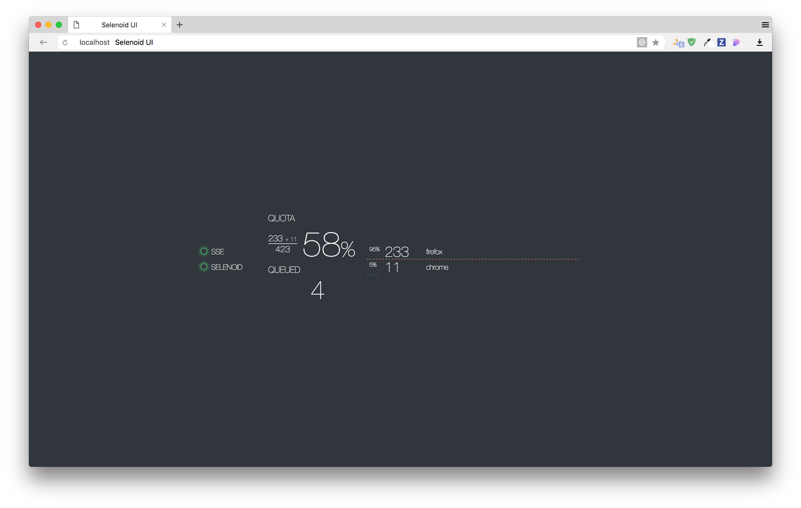

# Selenoid UI
[](https://travis-ci.org/lanwen/selenoid-ui)
[](https://codecov.io/gh/lanwen/selenoid-ui)

Simple status page with UI updates by SSE,
backed by constant polling of status handle
of [selenoid](https://github.com/aandryashin/selenoid) on small go backend.



## Building

1) Ensure you have [yarn](https://github.com/yarnpkg/yarn) and [go-bindata-assetfs](https://github.com/elazarl/go-bindata-assetfs) installed

2) Generate static resources:
```
$ go generate ./web ./...
```
3) Build:
```
$ go build
```
4) To build Docker container type:
```
$ GOOS=linux GOARCH=amd64 CGO_ENABLED=0 go build
$ docker build -t selenoid-ui:latest .
```
