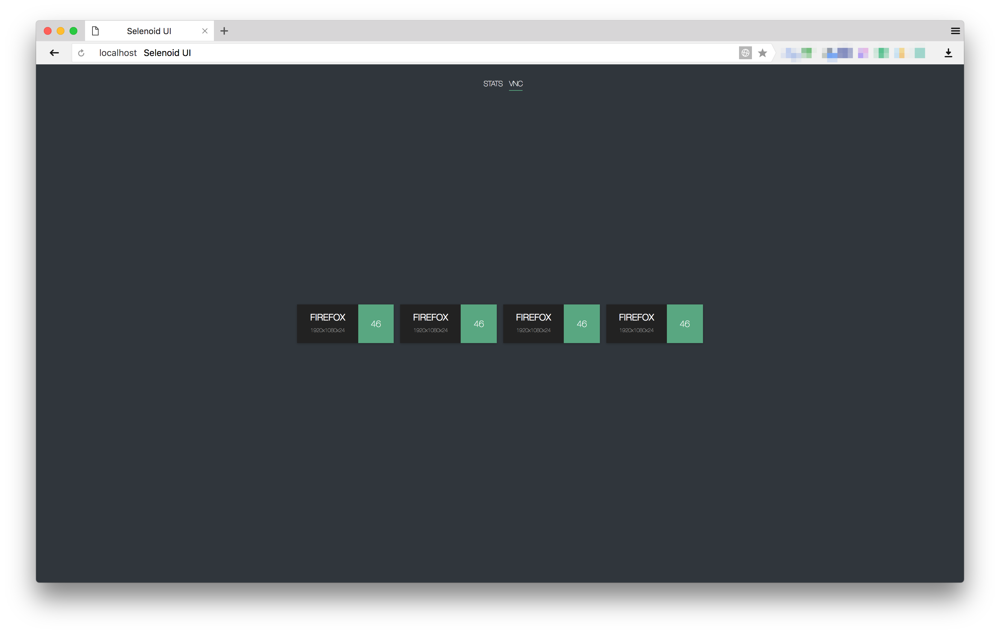
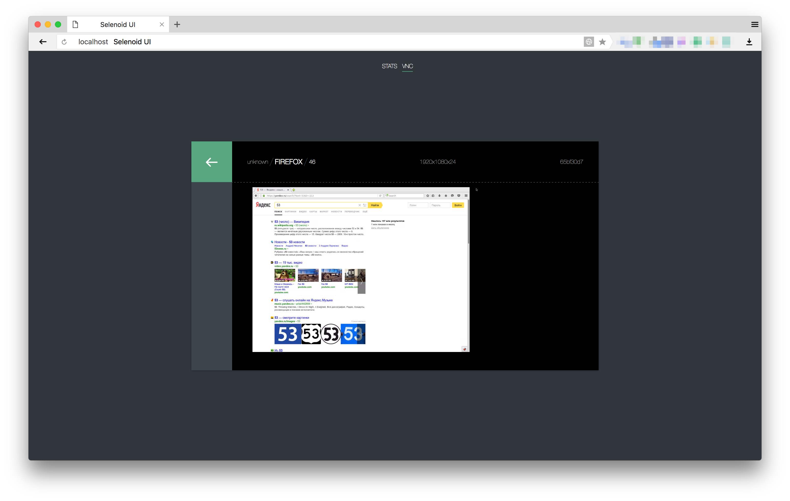
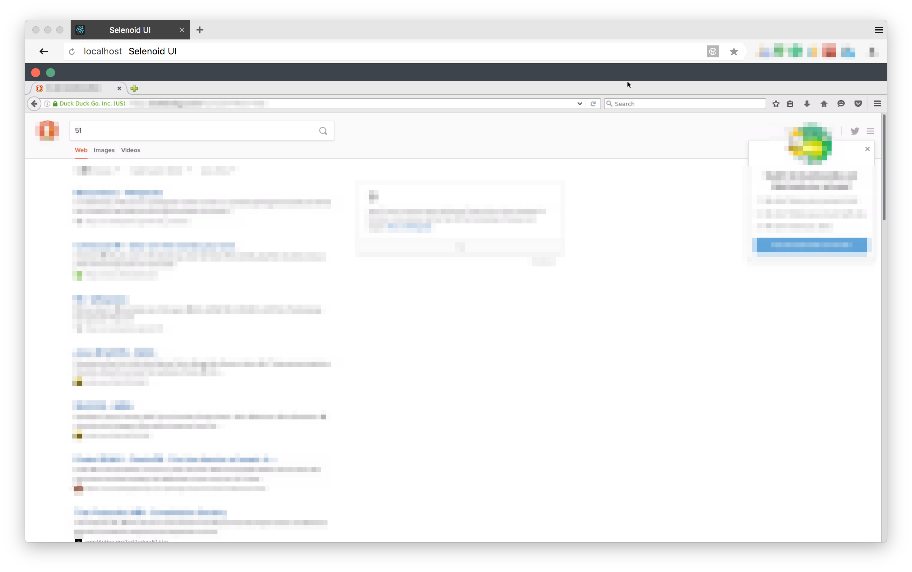

= Selenoid UI. Reference Guide
:revdate: {docdate}
:toc: left
:toclevels: 3
:sectnums:
:sectanchors:
:Author: Kirill Merkushev, Ivan Krutov, Alexander Andryashin and the Aerokube community
:revnumber: latest
:icons: font
:source-highlighter: coderay

This reference for version: _{revnumber}_

Simple status page with UI updates by SSE,
backed by constant polling of status handle
of https://github.com/aerokube/selenoid[Selenoid] on small go backend.
Source code available at https://github.com/aerokube/selenoid-ui[GitHub].

== Quick Start Guide

=== You have Docker

. On the same host where the *selenoid* runs:
- Assumed you have `selenoid` container up and running
+
----
$ docker ps

CONTAINER ID        IMAGE                  COMMAND                  CREATED             STATUS              PORTS                                                   NAMES
fc479233071d        aerokube/selenoid      "/usr/bin/selenoid..."   10 minutes ago      Up 10 minutes       0.0.0.0:4444->4444/tcp                                  selenoid
----

- Just run linked UI:
+
----
$ docker run -d         \
    --name selenoid-ui  \
    --link selenoid     \ <1>
    -p 8080:8080        \
    aerokube/selenoid-ui --selenoid-uri=http://selenoid:4444 <2>
----
<1> `selenoid` is name of *Selenoid* container
<2> should be the same as link name
    
. If you don't want to use `--link` or have *Selenoid* on another host you need to determine direct selenoid uri first (it can't be localhost!).
- If you know this exact uri - just specify it.
If it inside another container on the same host - use the gateway address or the host interface address where the selenoid listens.
For MacOS it can be http://blog.michaelhamrah.com/2014/06/accessing-the-docker-host-server-within-a-container/[determined] with help of netstat.

- If you use default network mode, then just

----
$ DOCKER_GATEWAY_ADDR=`docker inspect selenoid -f {{.NetworkSettings.Gateway}}`
$ echo $DOCKER_GATEWAY_ADDR
172.17.0.1 <1>
----
<1> May be different

- And run Selenoid UI

----
$ docker run -d --name selenoid-ui -p 8080:8080 aerokube/selenoid-ui --selenoid-uri http://${DOCKER_GATEWAY_ADDR}:4444
----

=== You don't have Docker

. Download Selenoid UI binary from https://github.com/aerokube/selenoid-ui/releases[releases] page.

. Start it:
 
    $ ./selenoid-ui
    
. To connect to remote Selenoid just specify its URI:

    $ ./selenoid-ui --selenoid-uri http://<host-ip>:4444

== Features list:

=== Stats

Shows current quota usage, pending browsers and queue.
Gets updates via SSE, so no need to refresh browser to see what happens.

.Stats and capabilities
image:img/ui.png[ui]

=== Capabilities

You can choose browser from the available browser list and UI will provide
an example of setup with right capabilities. Examples available for several languages.

=== VNC

If you get browser from selenoid with `enableVNC=true` capability, you can see list of available screens:

.VNC list

VNC allows to see and interact with browser:

.Exact VNC session

.Fullscreen mode

Please refer to http://aerokube.com/selenoid/latest/#_live_browser_screen[selenoid documentation] about VNC usage.

=== LOGS

With same as VNC list you can see logs of docker container (no any additional action required)

.Logs
image:img/logs.png[logs]

include::contributing.adoc[]
