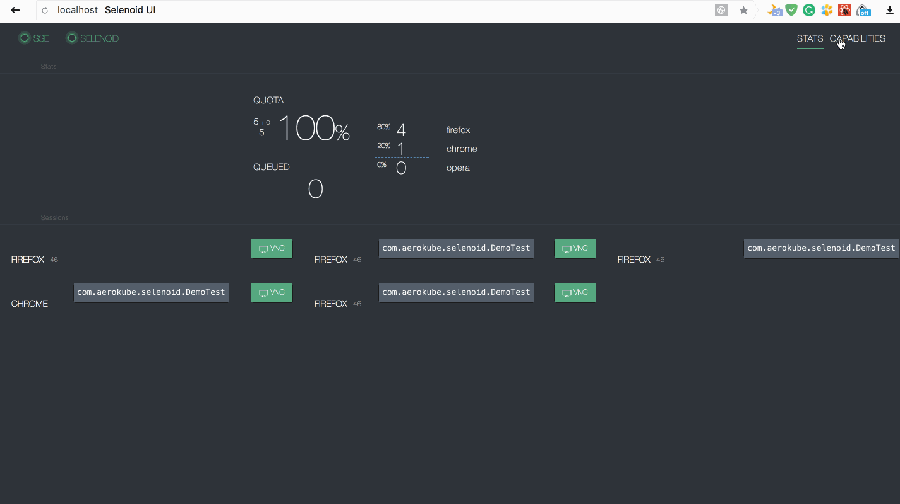
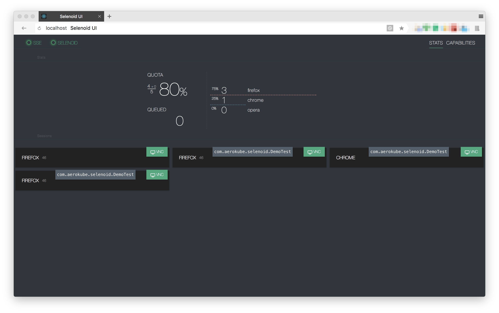
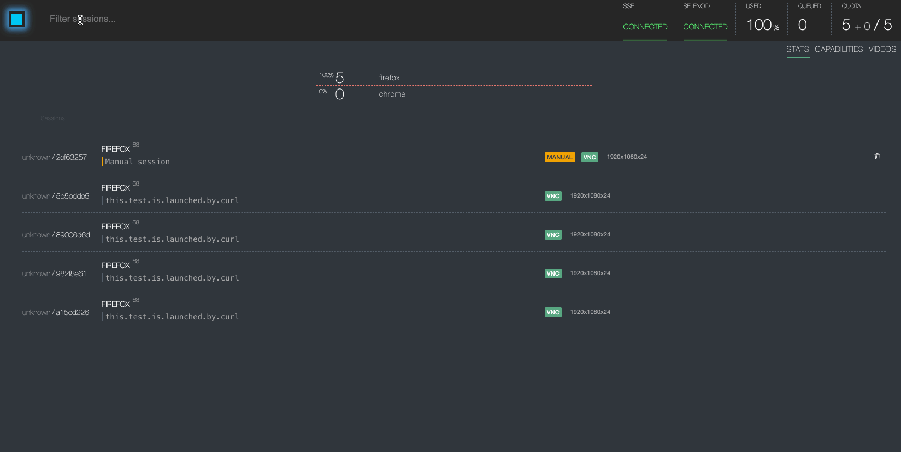
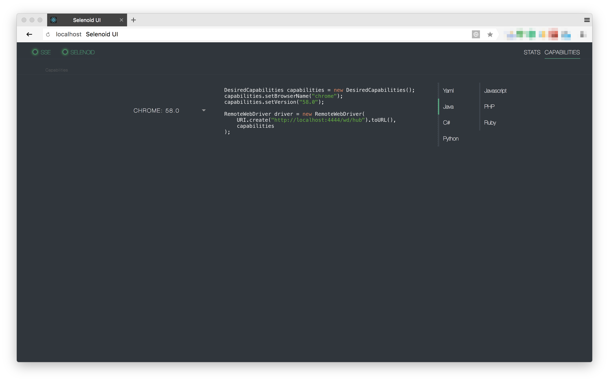
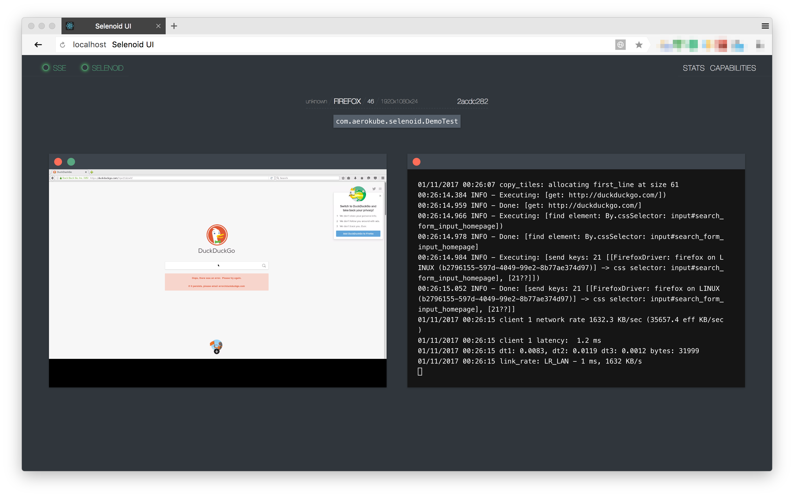

= Selenoid UI
:revdate: {docdate}
:toc: left
:toclevels: 3
:sectnums:
:sectanchors:
:Author: Kirill Merkushev, Ivan Krutov, Alexander Andryashin and the Aerokube community
:revnumber: latest
:icons: font
:source-highlighter: coderay
:docinfo: shared
:favicon: img/favicon.png

This reference for version: _{revnumber}_

Simple status page with UI updates by SSE,
backed by constant polling of status handle
of https://github.com/aerokube/selenoid[Selenoid] on small go backend.
Source code available at https://github.com/aerokube/selenoid-ui[GitHub].


_Recorded with https://github.com/justinfrankel/licecap[licecap]_

== Quick Start Guide

=== When you have Docker

. If you know exact uri of selenoid - just specify it with `--selenoid-uri`.
No matter this is the same host or not.
+
----
$ docker run -d --name selenoid-ui -p 8080:8080 aerokube/selenoid-ui --selenoid-uri http://${SELENOID_HOST}:4444
----
+
TIP: It can't be `localhost` or `127.0.0.1` until the UI is started in the same container as selenoid.

. When the UI and *Selenoid* on the same host you need to determine selenoid uri accessible from UI container.
Usually it can be the docker gateway address.
+
- If you use default network mode, firstly
+
----
$ DOCKER_GATEWAY_ADDR=`docker inspect selenoid -f {{.NetworkSettings.Gateway}}`
$ echo $DOCKER_GATEWAY_ADDR
172.17.0.1 <1>
----
<1> May be different
+
WARNING: For MacOS you should http://blog.michaelhamrah.com/2014/06/accessing-the-docker-host-server-within-a-container/[determine] interface with help of netstat.
Remember that gateway address and host address is not the same in this case.

You can also try magic command `ifconfig | grep -E "([0-9]{1,3}\.){3}[0-9]{1,3}" | grep -v 127.0.0.1 | awk '{ print $2 }' | cut -f2 -d: | head -n1`
+
- Then run Selenoid UI
+
----
$ docker run -d --name selenoid-ui -p 8080:8080 aerokube/selenoid-ui --selenoid-uri http://${DOCKER_GATEWAY_ADDR}:4444
----


. On the same host you can just _link_ with *selenoid* container:
- Assumed you have `selenoid` container already up and running
+
----
$ docker ps

CONTAINER ID        IMAGE                  COMMAND                  CREATED             STATUS              PORTS                                                   NAMES
fc479233071d        aerokube/selenoid      "/usr/bin/selenoid..."   10 minutes ago      Up 10 minutes       0.0.0.0:4444->4444/tcp                                  selenoid
----
+
- Just run linked UI:
+
----
$ docker run -d         \
    --name selenoid-ui  \
    --link selenoid     \ <1>
    -p 8080:8080        \
    aerokube/selenoid-ui --selenoid-uri=http://selenoid:4444 <2>
----
<1> `selenoid` is name of *Selenoid* container
<2> should be the same as link name
+
NOTE: UI will think that `http://selenoid:4444` is real address of selenoid.
But it's true only inside of UI container.

=== With Docker Compose

With docker compose remember to use the same network with selenoid and browser containers. For now this is only `bridge` network mode.

[source,yaml]
----
version: '3'
services:
  selenoid:
    image: "aerokube/selenoid"
    network_mode: bridge
    ports:
      - "4444:4444"
    volumes:
      - "$PWD:/etc/selenoid/" # assumed current dir contains browsers.json
      - "/var/run/docker.sock:/var/run/docker.sock"
  selenoid-ui:
    image: "aerokube/selenoid-ui"
    network_mode: bridge
    links:
      - selenoid
    ports:
      - "8080:8080"
    command: ["--selenoid-uri", "http://selenoid:4444"]
----

=== When you don't have Docker
.Or just want to dramatically simplify all the things :)

. Download Selenoid UI binary from https://github.com/aerokube/selenoid-ui/releases[releases] page.

. Start it:

    $ ./selenoid-ui --selenoid-uri http://<selenoid-host-or-ip>:4444

== Features list:

=== Stats and sessions

Shows current quota usage, pending browsers and queue.
Gets updates via SSE, so no need to refresh browser to see what happens.
It will reconnect automatically on any temp failures.
Each session on this screen can be closed.

.Stats and sessions


==== Search

Sessions are searchable based on the *id*, *browser*, or *test name*



=== Capabilities

You can choose browser from the available browser list and UI will provide
an example of setup with right capabilities. Examples available for several languages.

.Capabilities


==== Manual run

With selection of the browser it could be launched manually right in the interface. Technically,
that's just a session start call with timeout of *60m* and special https://aerokube.com/selenoid/latest/#_container_labels_labels[label]
`manual: "true"`. Based on that label, interface will highlight the session and add removal button.

NOTE: Protocol and the browser assumes that you will pass numerical value for the version.
This way "latest" version won't work. Please setup your selenoid accordingly.

=== Logs & VNC

If you get browser from selenoid with `enableVNC=true` capability, you can see list of available at stats page. Notice `VNC` badge.

VNC allows to see and interact with browser while log will reflect all driver actions:

.Exact VNC session


Pay attention to named sessions - you can achieve same result with `name=your.test.name` capability.

.Fullscreen mode
image:img/vnc-fs.png[ui]

Please refer to http://aerokube.com/selenoid/latest/#_live_browser_screen[selenoid documentation] about VNC usage.

==== Logs

You can see logs of docker container for each session even without vnc and name (no any additional action required)

.Logs
image:img/logs.png[logs]

=== Videos

You can view recorded videos, accessible on the selenoid, in case there are any on a separate tab.

=== Using With Ggr or Moon

By default Selenoid UI considers that the same daemon (Selenoid) is handles Selenium session creation and returns a list of already running sessions at `/status` API. However in more complicated cases like connecting Selenoid UI to a https://github.com/aerokube/ggr[Ggr] or https://github.com/aerokube/moon[Moon] cluster two separate daemons exist:

* *In Ggr cluster:* Ggr daemon creates sessions and GgrUI daemon delivers `/status` API.
* *In Moon cluster:* Moon daemon creates sessions and Moon API daemon delivers `/status` API.

To use Selenoid UI in such complicated environment you have to separately specify where Webdriver API and status API are listening. This can be done as follows:

    $ ./selenoid-ui --webdriver-uri http://<ggr-or-moon-host>:4444 --status-uri http://<ggr-ui-or-moon-api-host>:8888

By default `--webdriver-uri` and `--status-uri` flags are set to `--selenoid-uri` value.

=== CLI Flags

The following flags are supported by `selenoid-ui` command:

----
  -allowed-origin string
    	comma separated list of allowed Origin headers (use * to allow all)
  -listen string
    	host and port to listen on (default ":8080")
  -period duration
    	data refresh period, e.g. 5s or 1m (default 5s)
  -selenoid-uri string
    	selenoid uri to fetch data from (default "http://localhost:4444")
  -status-uri string
    	status uri to fetch data from
  -timeout duration
    	response timeout, e.g. 5s or 1m (default 3s)
  -users string
    	users file path
  -version
    	Show version and exit
  -webdriver-uri string
    	webdriver uri used to create new sessions
----

For example:
```
$ ./selenoid-ui -allowed-origin "*" -period 500ms
```
When using Selenoid UI inside Docker container these flags are passed like the following:

[source,bash,subs="attributes+"]
----
# docker run -d --name selenoid-ui                  \
    -p 8080:8080                                    \
    --link selenoid                                 \
    aerokube/selenoid-ui:latest-release             \
    -allowed-origin "*" -period 100ms
----

=== Docker healthcheck

When Selenoid UI is launched inside of container, the `/health-check` command would run every 30s inside of a container
to check if everything is still okay. To adjust the command in a custom extended container, you could supply it with arg
`-uri http://localhost:8080/ping` in an overridden `HEALTHCHECK` directive.

In case the status is unhealthy, you can get more insights with `docker inspect --format "{{json .State.Health}}" <container_id>` command,
that would give something like

[source,json,subs="attributes+"]
----
{
  "Status": "healthy",
  "FailingStreak": 0,
  "Log": [
    {
      "Start": "2020-02-10T00:21:57.7672821Z",
      "End": "2020-02-10T00:21:57.9054291Z",
      "ExitCode": 0,
      "Output": "2020/02/10 00:21:57 OK\n"
    },
    {
      "Start": "2020-02-10T00:22:27.8795685Z",
      "End": "2020-02-10T00:22:28.0146071Z",
      "ExitCode": 0,
      "Output": "2020/02/10 00:22:27 OK\n"
    }
  ]
}
----

include::contributing.adoc[]
