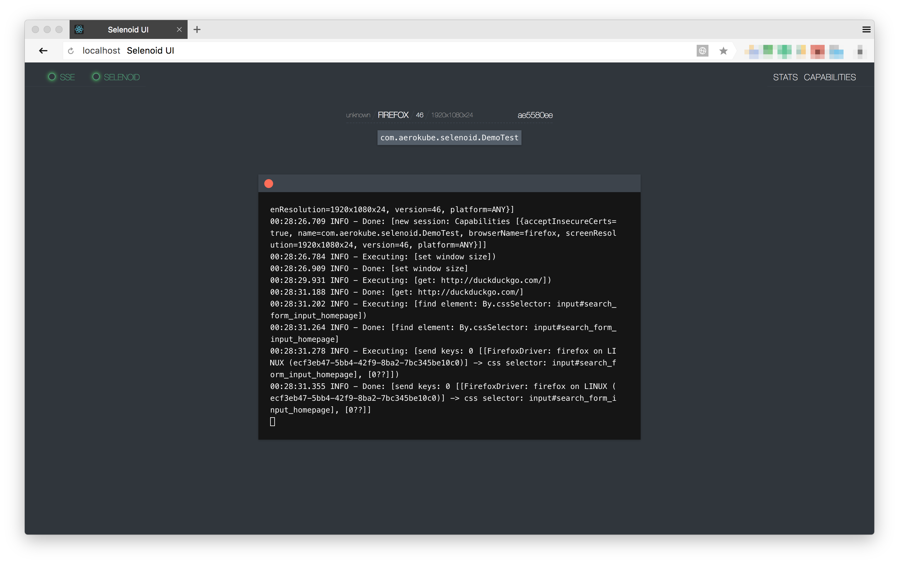

= Selenoid UI. Reference Guide
:revdate: {docdate}
:toc: left
:toclevels: 3
:sectnums:
:sectanchors:
:Author: Kirill Merkushev, Ivan Krutov, Alexander Andryashin and the Aerokube community
:revnumber: latest
:icons: font
:source-highlighter: coderay

This reference for version: _{revnumber}_

Simple status page with UI updates by SSE,
backed by constant polling of status handle
of https://github.com/aerokube/selenoid[Selenoid] on small go backend.
Source code available at https://github.com/aerokube/selenoid-ui[GitHub].

== Quick Start Guide

=== You have Docker

. Start UI with one command:

    # docker run -d --name selenoid-ui --net host aerokube/selenoid-ui
    
. If you don't want to use `--net host` or have no support (e.g. under MacOS) you need to http://blog.michaelhamrah.com/2014/06/accessing-the-docker-host-server-within-a-container/[determine] your Docker host IP address. Then launch Selenoid UI like the following:
    
    # docker run -d --name selenoid-ui -p 8080:8080 aerokube/selenoid-ui -selenoid-uri http://<host-ip>:4444

=== You don't have Docker

. Download Selenoid UI binary from https://github.com/aerokube/selenoid-ui/releases[releases] page.

. Start it:
 
    $ ./selenoid-ui
    
. To connect to remote Selenoid just specify its URI:

    $ ./selenoid-ui -selenoid-uri http://<host-ip>:4444

== Features list:

=== Stats

Shows current quota usage, pending browsers and queue.
Gets updates via SSE, so no need to refresh browser to see what happens.

.Stats and capabilities
image:img/ui.png[ui]

=== Capabilities

You can choose browser from the available browser list and UI will provide
an example of setup with right capabilities. Examples available for several languages.

=== VNC

If you get browser from selenoid with `enableVNC=true` capability, you can see list of available screens:

.VNC list
image:img/vnc-list.png[ui]

VNC allows to see and interact with browser:

.Exact VNC session
image:img/vnc.png[ui]

.Fullscreen mode
image:img/vnc-fs.png[ui]

Please refer to http://aerokube.com/selenoid/latest/#_live_browser_screen[selenoid documentation] about VNC usage.

=== LOGS

With same as VNC list you can see logs of docker container (no any additional action required)

.Logs

include::contributing.adoc[]
