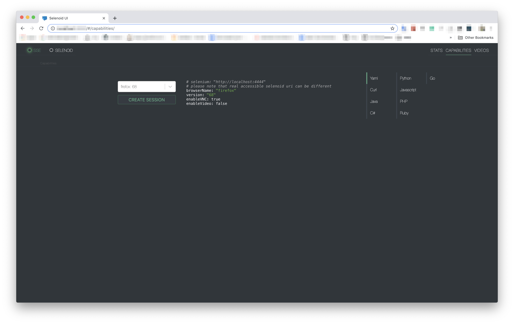

= Selenoid UI
:revdate: {docdate}
:toc: left
:toclevels: 3
:sectnums:
:sectanchors:
:Author: Kirill Merkushev, Ivan Krutov, Alexander Andryashin and the Aerokube community
:revnumber: latest
:icons: font
:source-highlighter: coderay
:docinfo: shared
:favicon: img/favicon.png

This reference for version: _{revnumber}_

Simple status page with UI updates by SSE,
backed by constant polling of status handle
of https://github.com/aerokube/selenoid[Selenoid] on small go backend.
Source code available at https://github.com/aerokube/selenoid-ui[GitHub].


_Recorded with https://github.com/justinfrankel/licecap[licecap]_

== Quick Start Guide

=== When you have Docker

. If you know exact uri of selenoid - just specify it with `--selenoid-uri`.
No matter this is the same host or not.
+
----
$ docker run -d --name selenoid-ui -p 8080:8080 aerokube/selenoid-ui --selenoid-uri http://${SELENOID_HOST}:4444
----
+
TIP: It can't be `localhost` or `127.0.0.1` until the UI is started in the same container as selenoid.

. When the UI and *Selenoid* on the same host you need to determine selenoid uri accessible from UI container.
Usually it can be the docker gateway address.
+
- If you use default network mode, firstly
+
----
$ DOCKER_GATEWAY_ADDR=`docker inspect selenoid -f {{.NetworkSettings.Gateway}}`
$ echo $DOCKER_GATEWAY_ADDR
172.17.0.1 <1>
----
<1> May be different
+
WARNING: For MacOS you should http://blog.michaelhamrah.com/2014/06/accessing-the-docker-host-server-within-a-container/[determine] interface with help of netstat.
Remember that gateway address and host address is not the same in this case.

You can also try magic command `ifconfig | grep -E "([0-9]{1,3}\.){3}[0-9]{1,3}" | grep -v 127.0.0.1 | awk '{ print $2 }' | cut -f2 -d: | head -n1`
+
- Then run Selenoid UI
+
----
$ docker run -d --name selenoid-ui -p 8080:8080 aerokube/selenoid-ui --selenoid-uri http://${DOCKER_GATEWAY_ADDR}:4444
----


. On the same host you can just _link_ with *selenoid* container:
- Assumed you have `selenoid` container already up and running
+
----
$ docker ps

CONTAINER ID        IMAGE                  COMMAND                  CREATED             STATUS              PORTS                                                   NAMES
fc479233071d        aerokube/selenoid      "/usr/bin/selenoid..."   10 minutes ago      Up 10 minutes       0.0.0.0:4444->4444/tcp                                  selenoid
----
+
- Just run linked UI:
+
----
$ docker run -d         \
    --name selenoid-ui  \
    --link selenoid     \ <1>
    -p 8080:8080        \
    aerokube/selenoid-ui --selenoid-uri=http://selenoid:4444 <2>
----
<1> `selenoid` is name of *Selenoid* container
<2> should be the same as link name
+
NOTE: UI will think that `http://selenoid:4444` is real address of selenoid.
But it's true only inside of UI container.

=== With Docker Compose

With docker compose remember to use the same network with selenoid and browser containers. For now this is only `bridge` network mode.

[source,yaml]
----
version: '3'
services:
  selenoid:
    image: "aerokube/selenoid"
    network_mode: bridge
    ports:
      - "4444:4444"
    volumes:
      - "$PWD:/etc/selenoid/" # assumed current dir contains browsers.json
      - "/var/run/docker.sock:/var/run/docker.sock"
  selenoid-ui:
    image: "aerokube/selenoid-ui"
    network_mode: bridge
    links:
      - selenoid
    ports:
      - "8080:8080"
    command: ["--selenoid-uri", "http://selenoid:4444"]
----

=== When you don't have Docker
.Or just want to dramatically simplify all the things :)

. Download Selenoid UI binary from https://github.com/aerokube/selenoid-ui/releases[releases] page.

. Start it:
 
    $ ./selenoid-ui --selenoid-uri http://<selenoid-host-or-ip>:4444

== Features list:

=== Stats and sessions

Shows current quota usage, pending browsers and queue.
Gets updates via SSE, so no need to refresh browser to see what happens.
It will reconnect automatically on any temp failures.

.Stats and sessions


=== Capabilities

You can choose browser from the available browser list and UI will provide
an example of setup with right capabilities. Examples available for several languages.

.Capabilities


=== Logs & VNC

If you get browser from selenoid with `enableVNC=true` capability, you can see list of available at stats page. Notice `VNC` badge.

VNC allows to see and interact with browser while log will reflect all driver actions:

.Exact VNC session


Pay attention to named sessions - you can achieve same result with `name=your.test.name` capability.

.Fullscreen mode


Please refer to http://aerokube.com/selenoid/latest/#_live_browser_screen[selenoid documentation] about VNC usage.

==== Logs

You can see logs of docker container for each session even without vnc and name (no any additional action required)

.Logs
image:img/logs.png[logs]

include::contributing.adoc[]

=== CLI Flags

The following flags are supported by `selenoid-ui` command:

----
  -allowed-origin string
    	comma separated list of allowed Origin headers (use * to allow all)
  -listen string
    	host and port to listen on (default ":8080")
  -period duration
    	data refresh period, e.g. 5s or 1m (default 5s)
  -selenoid-uri string
    	selenoid uri to fetch data from (default "http://localhost:4444")
  -timeout duration
    	response timeout, e.g. 5s or 1m (default 3s)
  -version
    	Show version and exit
----

For example:
```
$ ./selenoid-ui -allowed-origin "*" -period 500ms
```
When using Selenoid UI inside Docker container these flags are passed like the following:

[source,bash,subs="attributes+"]
----
# docker run -d --name selenoid-ui                  \
    -p 8080:8080                                    \
    --link selenoid                                 \
    aerokube/selenoid-ui:latest-release             \
    -allowed-origin "*" -period 100ms
----